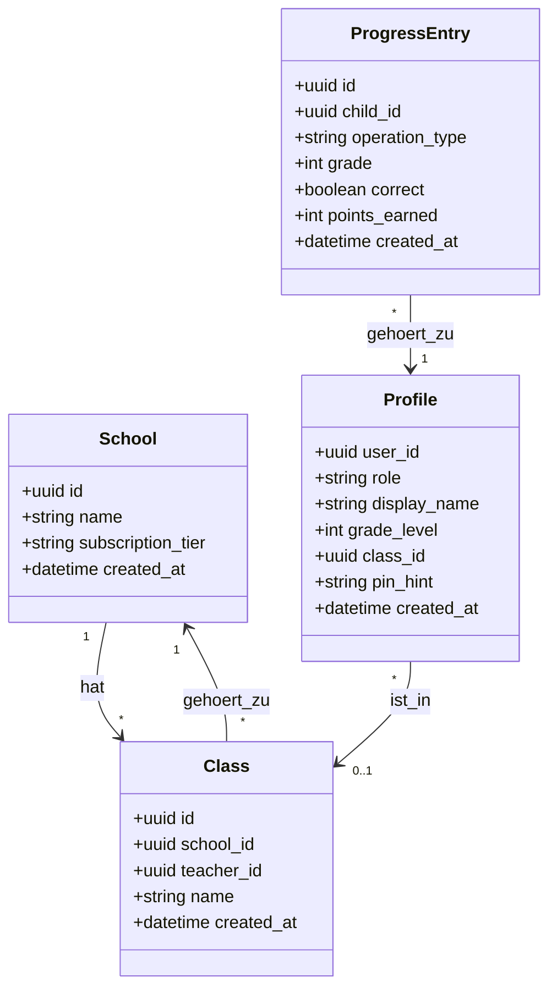
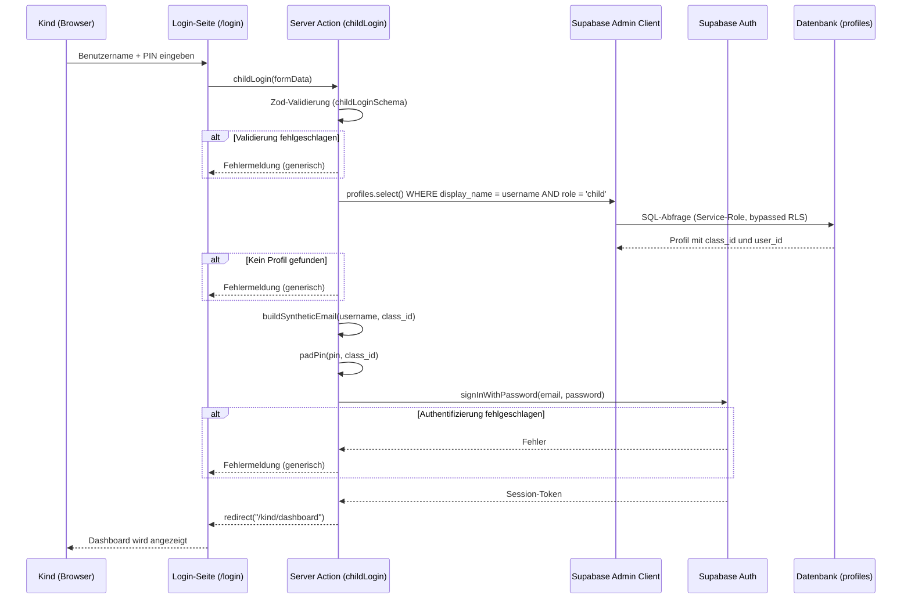
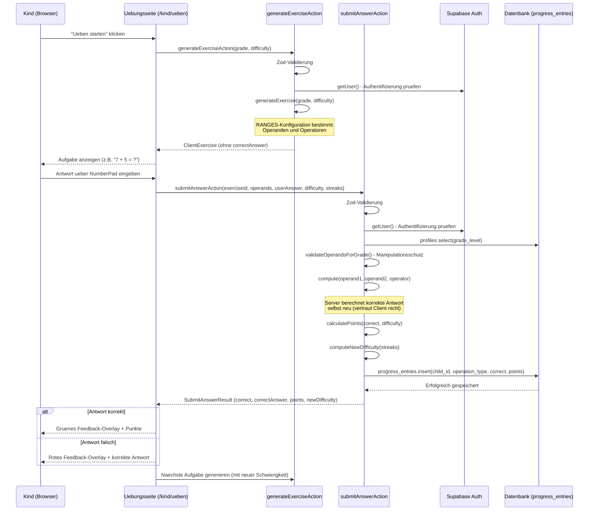
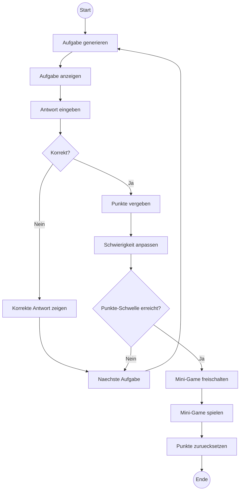

# Technische Diagramme der Mathe-Lernapp

## Einleitung

Dieses Dokument enthaelt die zentralen technischen Diagramme der Mathe-Lernapp fuer die Grundschule. Alle Diagramme sind in Mermaid-Syntax verfasst und koennen direkt in GitHub, VS Code oder anderen Mermaid-faehigen Viewern gerendert werden. Die Diagramme dokumentieren sowohl die Datenstruktur (Klassendiagramm) als auch die Kernprozesse der Anwendung (Sequenzdiagramme, Prozessdiagramm).

---

## 1. UML-Klassendiagramm: Datenbankschema

Das folgende Klassendiagramm bildet die vier zentralen Tabellen der PostgreSQL-Datenbank (Supabase) ab. Es zeigt die Attribute jeder Entitaet sowie die Beziehungen untereinander.

**Erlaeuterung der Beziehungen:**

Eine **Schule** (School) kann mehrere **Klassen** (Class) besitzen. Jede Klasse ist genau einer Schule zugeordnet und wird von einer Lehrkraft verwaltet (teacher_id verweist auf den authentifizierten Benutzer). **Profile** repraesentieren sowohl Kinder als auch Lehrkraefte, unterschieden durch das Feld `role` (`'child'` oder `'teacher'`). Kinder sind ueber `class_id` einer Klasse zugeordnet, waehrend bei Lehrkraeften dieses Feld leer bleibt (nullable). Die Tabelle **ProgressEntry** erfasst jeden einzelnen Aufgabenversuch eines Kindes mit Rechenart (`operation_type`), Klassenstufe, Korrektheit und verdienten Punkten. Das Feld `subscription_tier` der Schule steuert den Funktionsumfang (Free-Tier fuer Klasse 1-3, Abo-Pakete ab Klasse 4).

---

## 2. UML-Sequenzdiagramm: Kind-Login-Flow

Das folgende Sequenzdiagramm zeigt den vollstaendigen Authentifizierungsablauf, wenn sich ein Kind mit Benutzername und PIN anmeldet.

**Erlaeuterung:**

Der Login-Flow fuer Kinder basiert auf einem synthetischen E-Mail-System: Da Grundschulkinder keine eigene E-Mail-Adresse besitzen, wird aus dem Benutzernamen und der Klassen-ID eine kuenstliche E-Mail-Adresse konstruiert (z.B. `max-abc123@matheapp.local`). Die PIN wird ebenfalls mit der Klassen-ID kombiniert, um Kollisionen zwischen Klassen zu vermeiden. Aus Sicherheitsgruenden wird bei jedem Fehlschlag eine identische, generische Fehlermeldung zurueckgegeben, um Rueckschluesse auf existierende Benutzerkonten zu verhindern (Schutz vor User Enumeration).

---

## 3. UML-Sequenzdiagramm: Uebungssession-Flow

Das folgende Sequenzdiagramm zeigt den Ablauf einer vollstaendigen Uebungssession, von der Aufgabengenerierung bis zur Punktevergabe und Schwierigkeitsanpassung.

**Erlaeuterung:**

Die Uebungssession folgt einem sicherheitsbewussten Architekturmuster: Der Server sendet die Aufgabe ohne korrekte Antwort an den Client (Schutz vor Manipulation im Browser). Bei der Abgabe berechnet der Server die korrekte Antwort eigenstaendig aus den Operanden neu und validiert zusaetzlich, dass die Operanden zur Klassenstufe und Schwierigkeit passen (Schutz vor Trivialaufgaben-Einschleusung). Die Schwierigkeit passt sich automatisch an die Leistung des Kindes an: Nach mehreren korrekten Antworten in Folge steigt sie, nach mehreren Fehlern sinkt sie.

---

## 4. BPMN-Prozessdiagramm: Uebungsprozess mit Gamification-Loop

Das folgende Prozessdiagramm bildet den vollstaendigen Uebungsablauf als BPMN-aehnliches Flussdiagramm ab. Es zeigt den Kern-Loop der Aufgabenbearbeitung sowie das Gamification-Gate, das den Zugang zum Belohnungs-Minispiel steuert.

**Erlaeuterung des Prozessablaufs:**

Der **Kern-Loop** der Anwendung folgt dem Zyklus: Aufgabe generieren, anzeigen, Antwort entgegennehmen, auswerten und die naechste Aufgabe vorbereiten. Dieser Loop wiederholt sich kontinuierlich waehrend einer Uebungssession. Bei jeder korrekt geloesten Aufgabe werden Punkte als **Fortschrittsindikator** vergeben, deren Hoehe von der aktuellen Schwierigkeitsstufe abhaengt (hoehere Schwierigkeit ergibt mehr Punkte).

Das **Belohnungs-Gate** prueft nach jeder Punktevergabe, ob die gesammelte Punktzahl einen definierten Schwellenwert erreicht hat. Erst wenn diese Schwelle ueberschritten ist, wird das Minispiel als Belohnung freigeschaltet. Dieser Mechanismus stellt sicher, dass das Kind ausreichend geuebt hat, bevor es die Belohnung erhaelt. Die **Schwierigkeits-Adaption** passt sich automatisch an die Leistung des Kindes an: Nach mehreren korrekten Antworten in Folge steigt die Schwierigkeit, nach mehreren Fehlern wird sie reduziert, um Frustration zu vermeiden und den Lerneffekt zu maximieren.
