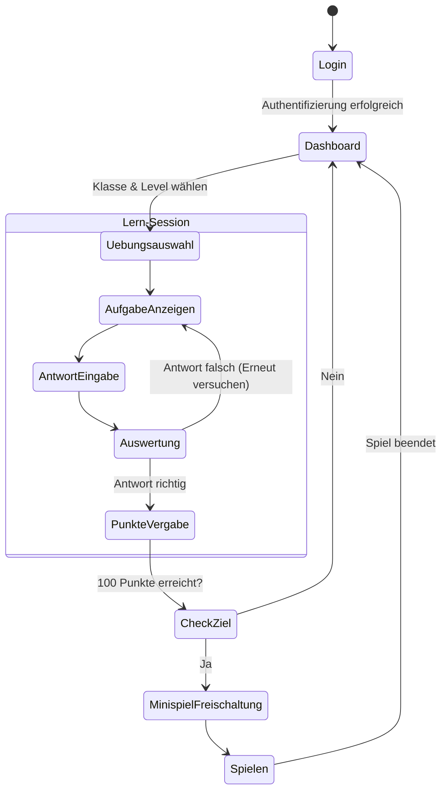

# Konzeptpapier: Mathe-Lernapp für die Grundschule (Klasse 1-4)

## 1. Einleitung und Geschäftsidee
Dieses Dokument beschreibt die Konzeption und Entwicklung einer neuartigen Mathematik-Lernanwendung für Grundschüler (Klasse 1 bis 4). Das Startup-Unternehmen stellt diese Software primär für Bildungseinrichtungen (B2B) zur Verfügung. 
Die Kernidee vereint pädagogisch wertvolles Lernen mit einem motivierenden Belohnungssystem (Gamification): Für erfolgreich gelöste Aufgaben sammeln die Kinder Punkte, die am Ende ein kleines Minispiel freischalten. 

## 2. Marktanalyse: Potenziale und Schwierigkeiten (Konkurrenz)
Der Markt für digitale Bildungsangebote (EdTech) in Deutschland wächst stetig, insbesondere im Bereich der Grundschulen.

**Potenziale:**
*   **Hoher Bedarf:** Mathematik ist das Nachhilfefach Nummer 1 (ca. 61% aller Nachhilfeschüler).
*   **Wachsender Druck in Klasse 4:** Vor dem Übertritt auf weiterführende Schulen (Mittlere Reife, Gymnasium) steigt die Nachfrage nach Förderung sprunghaft an. Studien zeigen, dass ca. 5-6% der Grundschulkinder externe Nachhilfe erhalten.
*   **B2B Skalierbarkeit:** Durch den Verkauf von Schullizenzen an Kommunen, Schulträger und öffentliche Einrichtungen kann mit einem Vertragsabschluss eine große Nutzerbasis erreicht werden.

**Schwierigkeiten (Markteintrittsbarrieren):**
*   **Strikte Datenschutzvorgaben (DSGVO):** Absolute Grundvoraussetzung für den Einsatz an öffentlichen Schulen.
*   **Föderalismus:** Die Lerninhalte müssen an die unterschiedlichen Lehrpläne der 16 Bundesländer angepasst werden.
*   **Starke Konkurrenz:** 
    *   *ANTON:* Der Marktführer. Kostenlos für Schüler, finanziert über Schul-Lizenzen (Freemium). Bietet alle Fächer.
    *   *Bettermarks:* Spezialisiert auf Mathe, hoch adaptiv, stark im B2B.
    *   *LMS (IServ, Moodle):* Systemumgebungen, in die sich neue Apps bestenfalls per Single-Sign-On integrieren müssen.

## 3. Findung des Marktsegments (Forschung, Umfrage & Ableitung)
**Segmentierung:**
Der Fokus liegt exklusiv auf der Grundschule, speziell auf dem **Übergang von der Primar- in die Sekundarstufe**. 
*   **Klasse 1-3 (Markteintritt & Bindung):** Kostenlose Bereitstellung. Ziel ist es, maximale Reichweite zu generieren, Lehrkräfte von der Qualität zu überzeugen und Schüler an die App zu binden (Habituation).
*   **ab Klasse 4 (Monetarisierung):** Hier entsteht der höchste Leidensdruck bzw. Förderbedarf für den Übertritt. Das System wechselt in ein umsatzgenerierendes Abo-Modell.

## 4. Wirtschaftlicher Aspekt & Abo-Modell
**Wertschöpfung:** Kinder lernen durch passgenaue, spielerische Übungen besser Mathematik. Dies entlastet Lehrkräfte, beruhigt Eltern und steigert die schulische Leistung.

**Das Abo-Modell (Klasse 4+):**
Das Modell teilt sich in drei zukunftsorientierte Pakete auf:
1.  **Grundschulniveau (Basis):** Festigung des Standard-Lehrplans. Sicherstellung der basalen Fähigkeiten.
2.  **Förderung (Vorbereitung Mittlere Reife):** Leicht erhöhtes Niveau, gezielte Vorbereitung auf Realschule/Gesamtschule.
3.  **Experte (Vorbereitung Gymnasium):** Komplexe Transferaufgaben, hohes Lerntempo, intensive Vorbereitung auf die gymnasiale Laufbahn.

*Zukunfts-Strategie:* Spätere Erweiterung auf einen B2C-Markt (Eltern zahlen direkt für ihre Kinder, falls die Schule keine Lizenz hat).

## 5. Ausformulierung und Ableitung der Forschungsfrage
Basierend auf der Konkurrenzanalyse und dem Geschäftsmodell ergibt sich für das Projekt folgende zentrale Forschungsfrage:
> *"Wie lässt sich eine gamifizierte Mathematik-Lernanwendung unter Anwendung eines Freemium-Modells (kostenlos für Klasse 1-3, kostenpflichtig für Klasse 4) erfolgreich im B2B-Markt deutscher Grundschulen etablieren, um sowohl die Schülermotivation durch ein integriertes Belohnungssystem zu maximieren als auch ein profitables EdTech-Startup aufzubauen?"*

## 6. Positionierung der Anwendung im Markt
Die App positioniert sich als **spezialisierter Begleiter für den Schulübergang**. Während Konkurrenten wie ANTON auf "Breite" (alle Fächer) setzen, setzt diese Anwendung auf "Tiefe" in Mathematik und psychologische Motivation (Belohnungsspiele). Sie ist nicht nur ein Übungsheft, sondern ein strategisches Karriere-Vorbereitungs-Tool für Grundschüler in Richtung Gymnasium oder Realschule.

---

## 7. Prozess- und Systemdesign (UML / BPMN)

Das folgende Aktivitätsdiagramm beschreibt den Kernprozess eines Kindes in der App sowie das Belohnungssystem:

**Beschreibung des Diagramms:**
1.  **Login & Dashboard:** Der Schüler (Nutzer) meldet sich an (im B2B Kontext meist durch die Lehrkraft provisioniert) und sieht seinen aktuellen Fortschritt auf dem Dashboard.
2.  **Lern-Session:** Der Nutzer wählt altersgerechte Aufgaben. Eine Aufgabe wird gelöst. Ist sie falsch, gibt es Hilfestellung und einen neuen Versuch. Ist sie richtig, werden **Erfahrungspunkte** gutgeschrieben.
3.  **Gamification-Loop (Punkte & Minispiel):** Das System prüft fortlaufend, ob ein gewisser Schwellenwert (z.B. 100 Punkte) erreicht ist. Ist dies der Fall, schaltet sich zur Belohnung ein kurzes Minispiel (z.B. 2 Minuten "Jump'n'Run") frei. Danach geht es zurück ins Dashboard, um den Lernfokus aufrechtzuerhalten.

---

## 8. Beschreibung der technischen Umsetzung (Projektplan in Next.js & Supabase)

**1. Datenbank & Backend (Supabase):**
*   PostgreSQL Datenbank für Nutzer (Lehrer & Schüler).
*   Tabellen für `classes` (Klassen), `profiles` (Schüler-Profile), `exercises` (Fortschritt der Übungen) und `points` (Belohnungssystem).
*   Authentifizierung per Role-Level-Security (RLS), damit Kinder nur ihre eigenen Daten sehen.

**2. Frontend Programmiersprache & Framework:**
*   **Next.js (React) mit TypeScript:** Ermöglicht sichere, schnelle und SEO-freundliche Webentwicklung.
*   **Tailwind CSS:** Für eine kindergerechte, bunte und leicht bedienbare Oberfläche (große Buttons, klare Farben).

**3. Gamification & Animationen:**
*   Einsatz von *Framer Motion* für Belohnungs-Animationen (z.B. fliegende Sterne bei richtiger Antwort).
*   Integration von *Phaser.js* oder CSS-basierten Elementen für das finale Belohnungs-Minispiel.

**4. Hosting:**
*   Veröffentlichung (Deployment) über **Vercel** für schnelle Skalierbarkeit und permanente Verfügbarkeit für Schulen.
